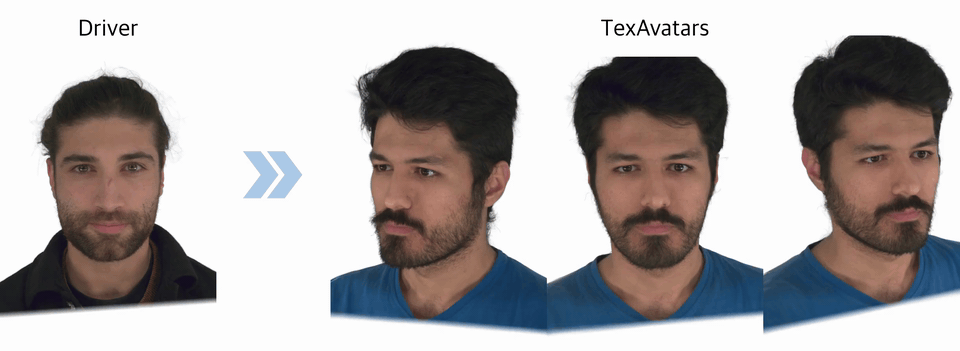

 ## TexAvatars: Hybrid Texel–3D Representations for Stable Rigging of Photorealistic Gaussian Head Avatars

  

  <a href="https://summertight.github.io/TexAvatars/">Project Page</a>
  &nbsp;•&nbsp;
  <a href="https://arxiv.org/abs/2512.21099">arXiv</a>

### 🚨 Important Note

A detailed README describing the code release schedule and usage will be provided later today!